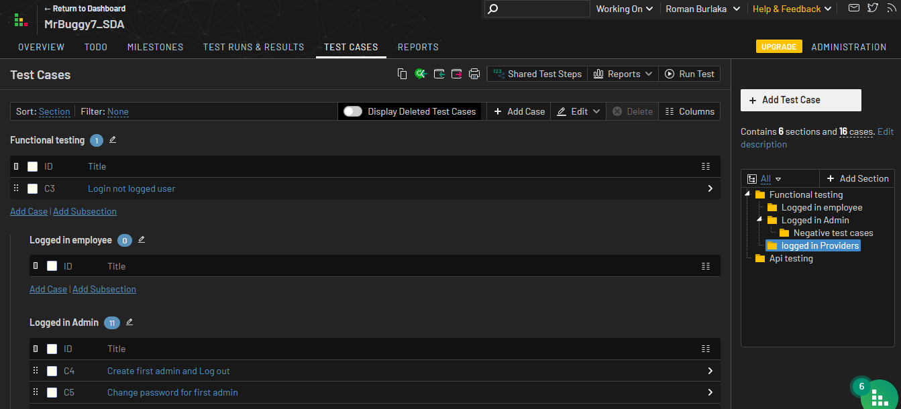
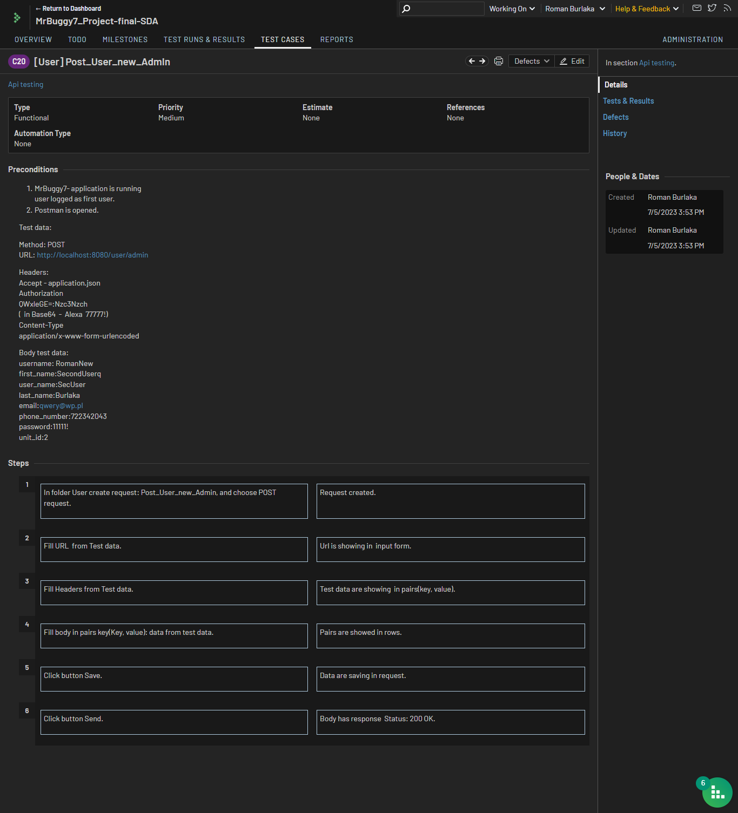
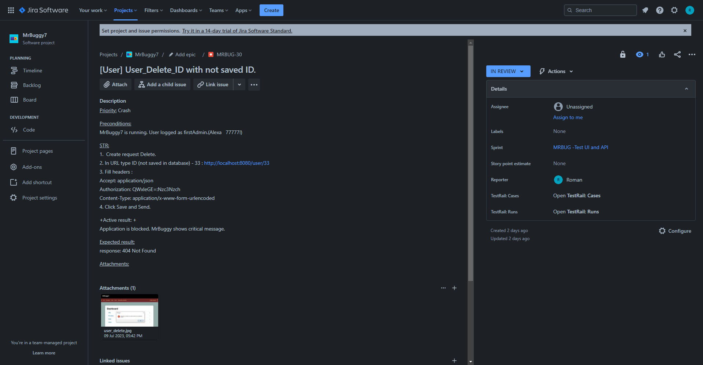

# SDA_Project_final
## Roman Burlaka 
## ZDTESTpol127 
## Testing project -  application MRBuggy7

## About project Testing application MrBuggy7:
### - MrBuggy7 is desktop application
### - the goal of this application is to efficiently manage Change Requests for multiple suppliers. 
### - [testing was based on functional specification](http://mrbuggy.pl/mrbuggy7/MrBuggy-Functional-Specification-v1.pdf)

***
### Results:
#### - [test plan](https://docs.google.com/spreadsheets/d/1gHLpGdckxEEoNOkktPC62YFnY14RTzOetkHMWo-2M7A/edit?usp=sharing)
#### - testcases in TestRail
#### - [summary test report in TestRail](https://drive.google.com/file/d/1-JcHw5H45T9Jic1XHpRtArojSm7VAxww/view?usp=sharing )
#### - [list of testcases in google sheets](https://docs.google.com/spreadsheets/d/107qkuqqB4tE09mclHUjWKc572MCsWVWx9CjnkjlSGY4/edit?usp=sharing)
#### - [card of exploration testing](https://docs.google.com/spreadsheets/d/1dOjKKj23HyAQjm-y4x08gIGgUi_GdtGcDSmiZ5UBP58/edit?usp=sharing)
#### - [list of bugs in google sheets](https://docs.google.com/spreadsheets/d/1LnArXRqWuJHqxGZwMoTX1praKBvXClkbAJ8vDReDUDQ/edit?usp=sharing)
#### - bugs in Jira 
#### - collection with requests in Postman.

### Example of test case in TestRail:

### Example of bug report in Jira:

***
### Additional:
#### - [automation tests: selenium Web driver(java) and scenarios BDD](https://demoqa.com/books)
#### - [github](https://github.com/RomanBurlaka78/Selenium_Demoqa_BDD#readme)
### - summary end2end report
***
### My Skills

-fff?style=for-the-badge&logo=Selenium)

